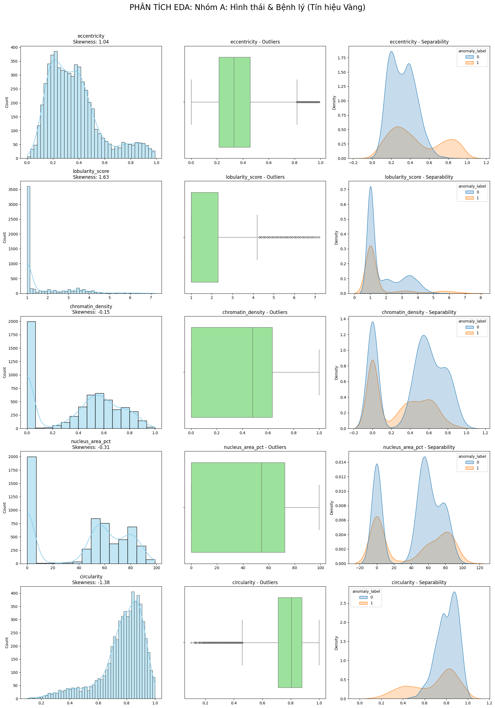
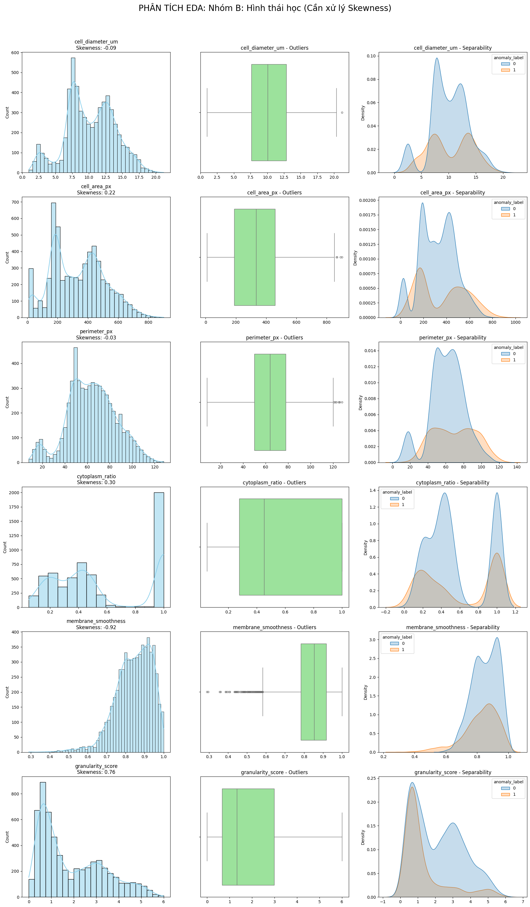
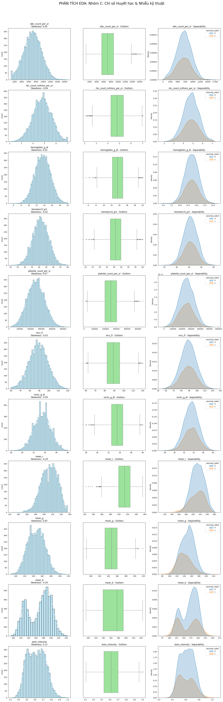
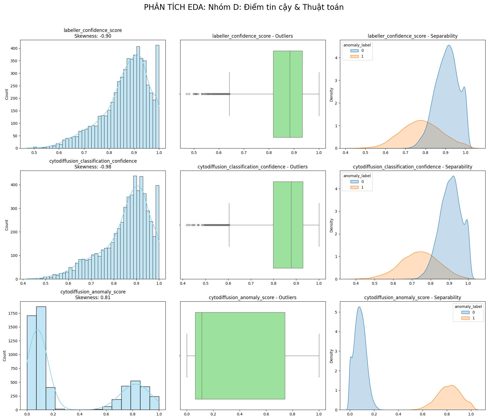

## 1. Nhóm A: Hình thái & Bệnh lý (Tín hiệu Vàng)

- **Đặc trưng phân phối:**
  - **Phân tách (Separability):** Rất tốt. Nhãn 0 và 1 có vùng phân phối tách biệt rõ rệt (đặc biệt là `eccentricity` và `lobularity_score`).
  - **Hình dạng:** Lệch nặng (Skewed), xuất hiện dải Outliers dài và dày đặc trong Boxplot.
- **Kết luận hướng xử lý:**
  - **Outlier:** **Giữ lại toàn bộ**. Đây là các mẫu bệnh lý đặc trưng. Áp dụng **Capping (Winsorization)** ở phân vị 1% và 99% để "nén" các giá trị cực trị, tránh làm nhiễu các mô hình tuyến tính (Logistic, SVM).
  - **Biến đổi:** Sử dụng **Power Transformer (Yeo-Johnson)** để đưa về phân phối chuẩn cho các mô hình Bayes và MLP.
  - **Scaling:** Bắt buộc dùng **RobustScaler** (tính toán dựa trên Median và IQR) thay vì StandardScaler để bảo vệ các đặc tính của Outliers.

  

## 2. Nhóm B: Đặc điểm Hình thái học (Đa đỉnh)

- **Đặc trưng phân phối:**
  - **Phân tách:** Trung bình. Có sự chồng lấp giữa hai nhãn, cần kết hợp nhiều biến mới có thể phân loại tốt.
  - **Hình dạng:** Đa đỉnh (Multi-modal), cho thấy sự hiện diện của nhiều quần thể tế bào khác nhau. Skewness vừa phải.
- **Kết luận hướng xử lý:**
  - **Outlier:** Xử lý bằng **Capping** hoặc giữ nguyên (nếu dùng các mô hình họ Cây như XGBoost).
  - **Biến đổi:** Có thể giữ nguyên phân phối đa đỉnh hoặc dùng **QuantileTransformer** nếu bạn muốn đưa về phân phối đều (Uniform) hoặc chuẩn để mô hình dễ hội tụ hơn.
  - **Scaling:** **StandardScaler** (Z-score).

  

## 3. Nhóm C: Chỉ số Huyết học & Nhiễu kỹ thuật

- **Đặc trưng phân phối:**
  - **Phân tách:** Rất kém. KDE chồng khít hoàn toàn, không có khả năng phân loại nhãn ở cấp độ tế bào.
  - **Hình dạng:** Đối xứng, gần với phân phối Gauss (chuẩn). Outliers thưa thớt và rời rạc.
- **Kết luận hướng xử lý:**
  - **Outlier:** **Xóa bỏ (Trimming)** các mẫu nằm ngoài ngưỡng $1.5 \times IQR$. Đây chủ yếu là lỗi đo đạc hoặc nhiễu thiết bị.
  - **Scaling:** **Min-Max Scaler**.
  - **Lưu ý:** Nếu tài nguyên tính toán hạn chế, có thể xem xét loại bỏ bớt các biến này (Feature Selection) vì chúng đóng góp rất ít vào độ chính xác của mô hình phân loại tế bào.

  

## 4. Nhóm D: Điểm tin cậy & Thuật toán

- **Đặc trưng phân phối:**
  - **Phân tách:** `anomaly_score` tách biệt 100% (Dấu hiệu của rò rỉ dữ liệu). `confidence` lệch trái (người dán nhãn tự tin vào các mẫu bình thường hơn).
- **Kết luận hướng xử lý:**
  - **Loại bỏ:** **Drop cột `cytodiffusion_anomaly_score`** và **`cytodiffusion_classification_confidence`** để tránh rò rỉ dữ liệu (cả hai đều từ hệ thống cytodiffusion đã phân loại anomaly).
  - **Lọc dữ liệu:** Sử dụng `labeller_confidence_score` để lọc bỏ các hàng có độ tin cậy thấp (< 0.5), sau đó **drop cột** này (meta-feature, không phải thuộc tính tế bào).

  

---

### Bảng tóm tắt thực thi nhanh

| Thành phần xử lý        | Nhóm A (Vàng)     | Nhóm B (Hình thái)     | Nhóm C (Nhiễu/Huyết học) |
| :---------------------- | :---------------- | :--------------------- | :----------------------- |
| **Xử lý Outlier**       | Capping (Giữ lại) | Capping                | Trimming (Xóa)           |
| **Biến đổi Skew**       | Yeo-Johnson       | QuantileTransformer    | Không cần                |
| **Phương pháp Scaling** | **RobustScaler**  | StandardScaler         | **Min-Max Scaler**       |
| **Tầm quan trọng**      | Rất cao           | Cao                    | Thấp                     |

---

### Xử lý nhãn mục tiêu (`anomaly_label`)

Vì Skewness nhãn là `0.77`, tập dữ liệu của bạn đang bị lệch (Imbalanced).

- **Chiến lược:** Sử dụng **Stratified Shuffle Split** khi chia tập Train/Test để đảm bảo tỷ lệ nhãn bất thường đồng đều ở cả hai tập.

[Chi tiết xử lý](./numeric/advanced-numeric-processing.md)
